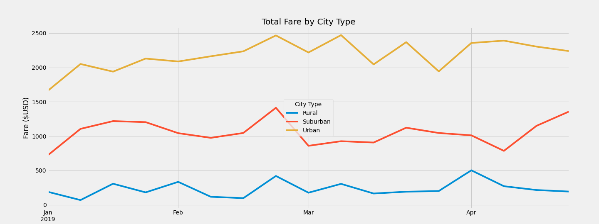

# PyBer_Analysis
### Module 5 of Bootcamp.

# Project Overview
### Use visualulization techniques to give insight into the data of Pyber , a ride sharing company.

# Chanllenge Overview 
### You’ve been asked by your CEO to create an overall snapshot of the ride-sharing data. In addition to your scatter and pie charts, she would like to see a summary table of key metrics of the ride-sharing data by city type, and a multiple-line graph that shows the average fare for each week by each city type.
# Results 

### By comparing the average fare per rides between each city type, rural cities have highest average fare per ride than suburban and urban by around four dollars and 10 dollars, respectively. For the column of average fare per driver, rural cities also perform well than suburban and urban cities by 40% and 230%. The reason is that the rides and drivers count of rural cities, significantly lower than urban and suburban cities. It leads to average values greater than urban and suburban.

# Graph 

### With this graph you can easily see that the graph is checking on the total fares by city type, rural, suburban, and urban, for the year 2019, where the months January through April are on focus. This graph show that rural areas have the least to pay fares, with suburban coming in with the second highest to pay fares, and finally urban with the most expensive fares out of the three city types. You can also notice that in May Urban cities hit their highest fare rates; whereas, rural hit their lowest pay rate in the same month.
